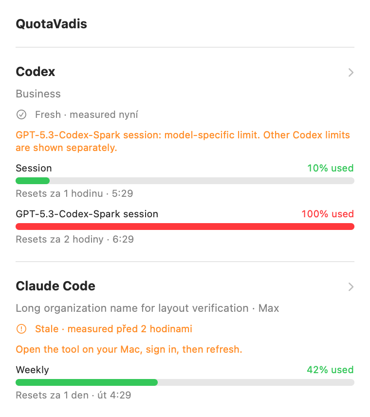

Astra review fixes — scoped implementation, 7 September 2026

The review references commit `29f4812`; this branch is rebased on `d5fd2fa` and preserves the intervening notification/release changes.

| Review item | Delivered |
| --- | --- |
| B1 | Bounded caller timeout, cancellable/reaped Codex helper with discarded stderr, explicit cancellable CloudKit operations, per-provider progress. A synchronous Keychain call cannot be forcibly interrupted; at most one underlying fetch per instance remains pending while other sources and later refreshes continue. |
| B2 | FIFO publish/removal queue, generation invalidation before and after account lookup, persisted removal intent, visible removal errors and manual/periodic/relaunch retry. |
| B3 | Additive provider status DTO with attempt/success times and safe failure codes. iOS/cards/widgets use measurement age, with a 15-minute stale threshold. Publication is labelled as transfer. Legacy payloads use fetchedAt; missing measurement dates do not default to now. |
| B4 | App delegate awaits the shared, coalesced refresh, cache/widget writes and notification submission, returning newData/noData/failed. Foreground activation refreshes after 60 seconds without a successful read. |
| B5 | Confirmed empty device lists clear the App Group file and reload widgets. Partial/unsupported CloudKit reads fail without replacing the last good device list. |
| B6 | Codex model windows count in worst usage and alerts independently of compact visibility. Overview and truncated widget lists retain binding model limits and name the affected model. |
| B7 | Validate usable windows/credits after tolerant mapping; reject unknown empty schemas, retain the last good snapshot, allow explicit unlimited/credits-only Codex responses. |
| B8 | Disabled providers cannot supply the menu bar selection or published costs; widget payload updates immediately and cloud sync is scheduled. Local caches are retained for re-enabling. |
| B9, first slice | Today is a calendar bucket in the publishing Mac's time zone, never simply the last bucket. Missing today's data displays Unavailable, report date/zone is shown, and a new day triggers a cost refresh on the next refresh cycle. |
| B10 | Shared accurate privacy wording lists account/organization/Mac/project-path metadata as well as numbers. Removal failures remain visible with sync switched off. |

UI MVP: a 380-point Mac popover, clear header and refresh action, explicit used percentages, reset below each bar, status and corrective guidance without opening detail, and a separate detail page with a return button. Settings/About/Quit retain shortcuts. QuotaUI shares the measurement status component with iOS. Widget timelines schedule age/reset boundaries, without resetting quota values locally.



This image renders QuotaUI with synthetic data (100% Spark, long organization name, stale cached Claude after unauthorized). It is not a screenshot of the running menu-bar app and does not verify keyboard interaction, widget-family layout or Dynamic Type.

Validation: `swift test` passes 35 tests (the process lifecycle test has both timeout and explicit-cancellation cases). Both unsigned Xcode builds pass, including widget extensions, with no compiler warnings:

```sh
xcodegen generate
swift test
xcodebuild -project QuotaVadis.xcodeproj -scheme QuotaVadis -destination 'generic/platform=macOS' -derivedDataPath /tmp/quotavadis-fixes-build CODE_SIGNING_ALLOWED=NO build
xcodebuild -project QuotaVadis.xcodeproj -scheme QuotaVadis-iOS -destination 'generic/platform=iOS Simulator' -derivedDataPath /tmp/quotavadis-fixes-build CODE_SIGNING_ALLOWED=NO build
```

Deferred: full Settings navigation/visual redesign; device/account selection and deep links for widgets; interactive cost charts; comprehensive keyboard, VoiceOver, Dynamic Type and contrast review; real-device silent-push and real-account CloudKit race testing; signing/distribution. B9's full cost error/last-success state pipeline, pricing/scanner/DST improvements and pagination diagnostics remain follow-up work. B10 changes the disclosure, not the payload's metadata scope: project paths still sync. Update Mac and companion/widget code together to get the new presentation semantics.
